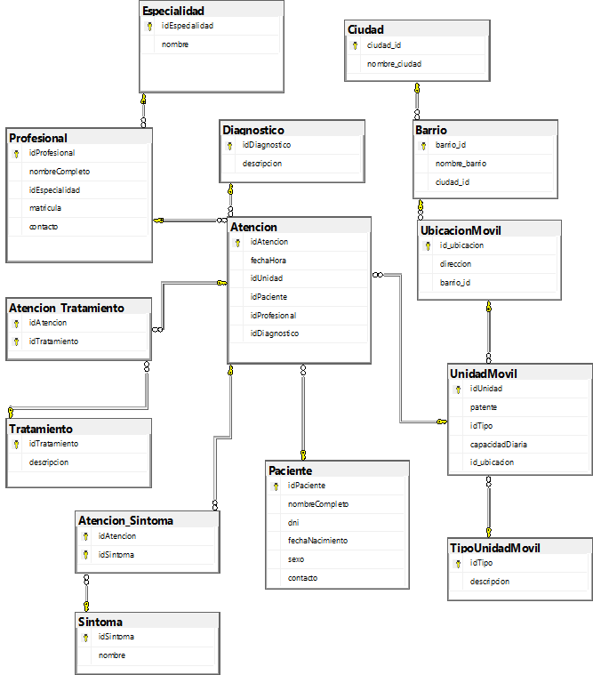
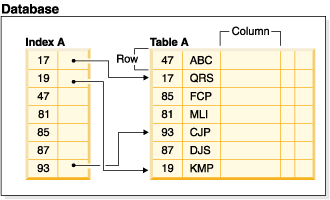

# Proyecto de Estudio
    
**Universidad Nacional del Nordeste**

**Facultad de Ciencias Exactas Naturales y Agrimensura**

**Carrera: Licenciatura en Sistemas de Información**

# MOVICAPS (Unidades Moviles de Atención Primaria)

**Asignatura**: Bases de Datos I (FaCENA-UNNE)

**Integrantes**:
 - Aranda Vera, Vanesa Alejandra Samanta
 - Prado, Sebastián
 - Frias, Javier Antonio 
 - Toledo, Agustina Ines

**Año**: 2025

## Índice

1. [CAPÍTULO I: INTRODUCCIÓN](#capítulo-i-introducción)</br>
   1.1. [Introducción](#introducción)</br>
   1.2. [Problema de Investigación](#problema-de-investigación)</br>
   1.3. [Alcance del Proyecto](#alcance-del-proyecto)</br>
   1.4. [Objetivo General](#objetivo-general)

2. [CAPITULO II: MARCO CONCEPTUAL O REFERENCIAL](#capitulo-ii-marco-conceptual-o-referencial)</br>
   2.1. [TEMA 1: Procedimientos y funciones almacenadas](#tema-1-procedimientos-y-funciones-almacenadas)</br>
   2.2. [TEMA 2: Optimización de consultas a través de índices](#tema-2-optimizacion-de-consultas-a-traves-de-indices)</br>
   2.3. [TEMA 3: Manejo de transacciones y transacciones anidadas](#tema-3-manejo-de-transacciones-y-transacciones-anidadas)</br>
   2.4. [TEMA 4: Manejo de permisos a nivel de usuarios de base de datos](#tema-4-manejo-de-permisos-a-nivel-de-usuarios-de-base-de-datos)

3. [CAPÍTULO III: METODOLOGÍA SEGUIDA](#capítulo-iii-metodología-seguida)</br>
   3.1. [a) Cómo se realizó el Trabajo Práctico](#a-cómo-se-realizó-el-trabajo-práctico)</br>
   3.2. [b) Herramientas (Instrumentos y procedimientos)](#b-herramientas-instrumentos-y-procedimientos)

4. [CAPÍTULO IV: DESARROLLO DEL TEMA / PRESENTACIÓN DE RESULTADOS](#capítulo-iv-desarrollo-del-tema--presentación-de-resultados)</br>
   4.1. [Diagrama relacional](#diagrama-relacional)</br>
   4.2. [Diccionario de datos](#diccionario-de-datos)</br>
   4.3. [Desarrollo TEMA 1 "PROCEDIMIENTOS Y FUNCIONES ALMACENADAS"](#desarrollo-tema-1-procedimientos-y-funciones-almacenadas)</br>
   4.4. [Desarrollo TEMA 2 "Optimización de consultas a través de índices"](#desarrollo-tema-2-optimización-de-consultas-a-través-de-índices)</br>
   4.5. [Desarrollo TEMA 3 "Manejo de transacciones y transacciones anidadas"](#desarrollo-tema-3-manejo-de-transacciones-y-transacciones-anidadas)</br>
   4.6. [Desarrollo TEMA 4 Manejo de permisos a nivel de usuario de base de datos](#desarrollo-tema-4-manejo-de-permisos-a-nivel-de-usuario-de-base-de-datos)

5. [CAPÍTULO V: CONCLUSIONES](#capítulo-v-conclusiones)

6. [BIBLIOGRAFÍA DE CONSULTA](#bibliografía-de-consulta)

---

## CAPÍTULO I: INTRODUCCIÓN

### Introducción 

La **atención médica primaria** en las ciudades se enfrenta a un problema: las clínicas fijas (CAP) no pueden moverse cuando hay una emergencia en otra zona (como un brote de gripe o un evento masivo).

**Nuestra Idea** proponer un **sistema flexible** que use **unidades móviles** (camionetas o vehículos equipados) que se puedan mover por toda la ciudad. Estas unidades son especializadas (generales, dentales, pediátricas, de vacunas).

El objetivo es tener un sistema que se adapte rápido a las necesidades de la gente. Si hay un brote en el barrio A, movemos más unidades a ese lugar.

### Problema de Investigación

La ausencia de un sistema automatizado en las unidades móviles de atención primaria dificulta el registro y la gestión eficiente de las atenciones realizadas en los distintos barrios de Corrientes Capital. Esta limitación impide identificar con precisión las necesidades particulares de cada barrio, restringe la capacidad de respuesta ante eventos multitudinarios y obstaculiza la planificación estratégica para la distribución óptima de los recursos móviles.

Ante esta problemática, el proyecto propone el desarrollo de un sistema automatizado capaz de registrar, organizar y analizar en tiempo real las atenciones brindadas. Esta solución tecnológica no solo mejorará la eficiencia operativa, sino que permitirá tomar decisiones informadas sobre el traslado de unidades móviles, adaptándose a la demanda y a eventos especiales. 

### Alcance del Proyecto

El alcance del trabajo incluye el diseño  implementación y optimización de una base de 
datos relacional utilizando SQL Server. Se enfocará en las siguientes áreas esenciales de gestión: administración de unidades móviles, gestión de personal, gestión clínica móvil, planificación territorial, generación de reportes. Quedan explícitamente fuera del alcance funcionalidades secundarias o de apoyo, como: gestión de nómina de empleados, inventario y stock de insumos y medicamentos, módulos de facturación o contabilidad.

### Objetivo General 

Desarrollar una Base de Datos Relacional para la gestión dinámica de Unidades Móviles de Atención Primaria, que permita administrar de manera eficiente la ubicación estratégica de las unidades especializadas, la asignación de personal médico y el registro de atenciones y diagnósticos. El sistema será implementado utilizando SQL Server, aplicando conceptos de roles, permisos, procedimientos almacenados y optimización de consultas para garantizar la integridad y la seguridad de los datos sanitarios y operativos.


## CAPITULO II: MARCO CONCEPTUAL O REFERENCIAL

### TEMA 1: Procedimientos y funciones almacenadas

Un **procedimiento almacenado** de SQL Server es un grupo de una o varias instrucciones. Los procedimientos pueden:
Aceptar parámetros de entrada y devolver varios valores en forma de parámetros de salida al programa que realiza la llamada.
Contener instrucciones de programación que realicen operaciones en la base de datos. Entre otras, pueden contener llamadas a otros procedimientos.
Devolver un valor de estado a un programa que realiza una llamada para indicar si la operación se ha realizado correctamente o se han producido errores, y el motivo de estos.

**Funciones definidas por el usuario**
Las funciones definidas por el usuario de SQL Server son rutinas que aceptan parámetros, realizan una acción, como un cálculo complejo, y devuelven el resultado de esa acción como un valor. El valor devuelto puede ser un valor escalar único o un conjunto de resultados.

### TEMA 2: Optimización de consultas a través de índices 

El uso de índices representa una de las técnicas esenciales para optimizar el rendimiento en sistemas de gestión de bases de datos relacionales. A medida que la cantidad de registros crece, la necesidad de acceder a los datos de manera eficiente se vuelve fundamental para garantizar tiempos de respuesta adecuados y una correcta experiencia de uso en aplicaciones de software.

En el presente informe se estudian los tipos principales de índices soportados por SQL Server, su utilidad, criterios para su creación y las consideraciones prácticas respecto al impacto que generan en operaciones de lectura y escritura. Asimismo, se demuestra la mejora en el rendimiento mediante pruebas controladas, comparando tiempos y planes de ejecución antes y después de la aplicación de índices adecuados. El objetivo es comprender cuándo y por qué utilizar índices.

### TEMA 3: Manejo de transacciones y transacciones anidadas

El manejo adecuado de transacciones es un pilar clave en los sistemas de gestión de bases de datos relacionales, especialmente en contextos empresariales críticos donde la integridad y consistencia de los datos son absolutamente vitales. SQL Server, uno de los sistemas más utilizados a nivel global, provee sofisticadas herramientas para el control de transacciones, permitiendo a los desarrolladores y administradores definir y controlar las operaciones para garantizar que los datos se mantengan seguros, coherentes y recuperables ante errores o fallos del sistema. En este informe se profundiza en la teoría, la sintaxis y las mejores prácticas referentes al manejo de transacciones y transacciones anidadas en SQL Server, con un enfoque en los objetivos de comprender la consistencia y atomicidad, implementar transacciones simples y anidadas, y documentar casos de prueba y manejo de fallos.

### TEMA 4: Manejo de permisos a nivel de usuarios de base de datos
Es el proceso mediante el cual se asignan, revocan o deniegan permisos específicos a usuarios o roles dentro de una base de datos, con el objetivo de controlar el acceso a objetos como tablas, vistas, procedimientos almacenados, funciones, esquemas y demás recursos. Permite minimizar los riesgos de modificaciones no autorizadas, garantizar la integridad de los datos y establecer un entorno seguro, donde cada usuario accede únicamente a los recursos necesarios para cumplir su función.

## CAPÍTULO III: METODOLOGÍA SEGUIDA 

 ### a) Cómo se realizó el Trabajo Práctico
Para iniciar el desarrollo del proyecto, se organizó una reunión entre los integrantes del grupo para definir el caso de estudio que abordaríamos a lo largo del trabajo. Una vez elegido el tema, para la primera parte de la entrega, se creó un repositorio en GitHub, donde cada miembro del equipo iría subiendo sus aportes para desarrollar las actividades asignadas y se elaboró el diagrama entidad-relación con su diccionario de datos para, posteriormente, avanzar con el modelo físico y el lote de datos con los que trabajaríamos.

En la segunda parte del proyecto, distribuimos los temas de investigación entre los miembros del equipo a través de un sorteo. Realizamos reuniones periodicas virtuales para coordinar sobre los avanzes realizados.

### b) Herramientas (Instrumentos y procedimientos)
- [SQL SERVER EXPRESS 22](https://www.microsoft.com/en-us/sql-server/sql-server-downloads)
- [Visual Studio Code](https://code.visualstudio.com/download)
- [Discord] (https://discord.com/)
- [Github] (https://github.com/sebianp/proyecto_base_datos_grupo_30)


## CAPÍTULO IV: DESARROLLO DEL TEMA / PRESENTACIÓN DE RESULTADOS 

### Diagrama relacional


### Diccionario de datos

Acceso al documento [PDF](./doc/diccionario_de_datos.pdf) del diccionario de datos.


### Desarrollo TEMA 1 "PROCEDIMIENTOS Y FUNCIONES ALMACENADAS"

**FUNCION**

Al igual que las funciones de los lenguajes de programación, las **funciones** definidas por el usuario de SQL Server son rutinas que aceptan parámetros, realizan una acción, como un cálculo complejo, y devuelven el resultado de esa acción como un valor. El valor devuelto puede ser un valor escalar único o un conjunto de resultados.

**Tipos de funciones**

**Funciones escalares**

Las funciones escalares definidas por el usuario devuelven un único valor de datos del tipo definido en la cláusula RETURNS. En una función escalar insertada, el valor escalar es el resultado de una sola instrucción. Para una función escalar de varias instrucciones, el cuerpo de la función puede contener una serie de instrucciones de Transact-SQL que devuelven el único valor. El tipo devuelto puede ser de cualquier tipo de datos excepto text, ntext, image, cursory timestamp.

**Funciones con valores de tabla**

Las funciones con valores de tabla definidas por el usuario (TVF) devuelven un tipo de datos table. Las funciones con valores de tabla insertadas no tienen cuerpo; la tabla es el conjunto de resultados de una sola instrucción SELECT. 

**Funciones del sistema**

SQL Server proporciona numerosas funciones del sistema que se pueden usar para realizar diversas operaciones. No se pueden modificar. Para obtener más información, vea ¿Qué son las funciones de SQL Database?, Funciones del sistema por categoría para Transact-SQL y vistas de administración dinámica del sistema.

**Directrices**

Las funciones de Transact-SQL manejan los errores de forma estricta: cualquier error detiene inmediatamente su ejecución y cancela la función invocadora, a diferencia de los procedimientos almacenados, donde la ejecución podría continuar con la siguiente instrucción. Estas rutinas deben ser libres de efectos secundarios, por lo que tienen prohibido realizar cambios permanentes en la base de datos o en recursos externos (como modificar tablas o enviar correos electrónicos), limitándose solo a manipular variables u objetos locales. Finalmente, debe tenerse en cuenta que el optimizador de consultas puede variar el número de veces que una función se ejecuta dentro de una cláusula (como en una subconsulta WHERE), dependiendo del plan de ejecución que se elija.
Las funciones deterministas deben estar enlazadas al esquema. Use la cláusula SCHEMABINDING al crear una función determinista.


**Procedimientos almacenados** (motor de base de datos)

Un procedimiento almacenado de SQL Server es un grupo de una o varias instrucciones Transact-SQL o una referencia a un método de Common Runtime Language (CLR) de Microsoft .NET Framework. Los procedimientos se asemejan a las construcciones de otros lenguajes de programación, porque pueden:

Aceptar parámetros de entrada y devolver varios valores en forma de parámetros de salida al programa que realiza la llamada.

Contener instrucciones de programación que realicen operaciones en la base de datos. Entre otras, pueden contener llamadas a otros procedimientos.

Devolver un valor de estado a un programa que realiza una llamada para indicar si la operación se ha realizado correctamente o se han producido errores, y el motivo de estos.


**Tipos de procedimientos almacenados**

**Definida por el usuario**

Un procedimiento definido por el usuario se puede crear en una base de datos definida por el usuario o en todas las bases de datos del sistema excepto en la base de datos Resource. El procedimiento se puede desarrollar en Transact-SQL o como referencia a un método de Common Language Runtime (CLR) de Microsoft .NET Framework.

**Temporario**

Los procedimientos temporales son una forma de procedimientos definidos por el usuario. Los procedimientos temporales son como un procedimiento permanente, salvo que se almacenan en tempdb. Hay dos tipos de procedimientos temporales: locales y globales. Se diferencian entre sí por los nombres, la visibilidad y la disponibilidad. Los procedimientos temporales locales tienen como primer carácter de sus nombres un solo signo de número (#); solo son visibles en la conexión actual del usuario y se eliminan cuando se cierra la conexión. Los procedimientos temporales globales presentan dos signos de número (##antes del nombre; son visibles para cualquier usuario después de su creación y se eliminan al final de la última sesión en la que se usa el procedimiento.

**Sistema**

Los procedimientos del sistema se incluyen con el motor de base de datos. Están almacenados físicamente en la base de datos interna y oculta Resourcey se muestran de forma lógica en el esquema sys de cada base de datos definida por el sistema y por el usuario. Además, la base de datos msdb también contiene procedimientos almacenados del sistema en el esquema dbo que se usan para programar alertas y trabajos. Dado que los procedimientos del sistema empiezan con el prefijo sp\_, le recomendamos que no use este prefijo cuando asigne un nombre a los procedimientos definidos por el usuario.

SQL Server admite los procedimientos del sistema que proporcionan una interfaz de SQL Server a los programas externos para varias actividades de mantenimiento. Estos procedimientos extendidos usan el prefijo xp\_.

**Definido por el usuario extendido**

Los procedimientos extendidos permiten crear rutinas externas en un lenguaje de programación, como C. Estos procedimientos son bibliotecas DLL que una instancia de SQL Server puede cargar y ejecutar de forma dinámica.

**Comparación entre Procedimientos y Funciones Almacenadas**

La deferencia fundamental entre un Procedimiento Almacenado y una Función Definida por el Usuario (UDF) reside en su capacidad para modificar la base de datos y cómo se integran en las consultas.

El propósito principal de un Procedimiento Almacenado es ejecutar un conjunto de acciones en el servidor, generalmente para implementar la lógica de negocio y las operaciones CRUD. Por ello, los procedimientos pueden realizar cambios definitivos en la base de datos (como INSERT, UPDATE, DELETE) y tienen permitido el control explícito de transacciones (COMMIT, ROLLBACK). En cambio, las Funciones Almacenadas están diseñadas para cálculos o la lectura de datos sin alteración; están estrictamente prohibidas de realizar cualquier manipulación de datos o tener efectos secundarios, lo que asegura la integridad de la base de datos.

En cuanto al retorno de valores, la diferencia también es significativa. Una Función Almacenada tiene la restricción de devolver siempre un único valor (ya sea un valor escalar simple o un único conjunto de resultados en formato TABLE). Por otro lado, un Procedimiento Almacenado es más flexible, ya que puede devolver múltiples conjuntos de resultados de varias consultas, además de múltiples parámetros de salida y un valor de estado para indicar el éxito o fracaso de su ejecución.

Finalmente, la manera de invocación en el código es la característica más visible. Las Funciones Almacenadas son altamente integrables, pudiendo ser utilizadas directamente dentro de sentencias SELECT, WHERE o HAVING como cualquier función de sistema nativa, o como fuente de datos en la cláusula FROM. Por el contrario, los Procedimientos Almacenados no son aptos para la composición de consultas y deben ser invocados de manera independiente mediante el comando EXECUTE o EXEC.

**SCRIPT con ejemplos aplicados al proyecto**
> Acceder a la siguiente carpeta  [scripts-> tema_01](./script/tema01/tema01_script.sql)

### Desarrollo TEMA 2 "Optimización de consultas a través de índices"

#### ¿Qué es un índice en bases de datos relacionales?

Un **índice** es un conjunto de punteros ordenados lógicamente por los valores de una o varias claves. Estos punteros hacen referencia a registros de una tabla con el fin de agilizar su localización.

En el siguiente diagrama tenemos un índice basado en los números de empleados de una tabla. Este valor de clave proporciona un puntero a las filas correspondientes. Por ejemplo, el número de empleado 19 apunta al empleado KMP.

Esto permite un acceso más eficiente a los datos creando una “vía rápida” hacia ellos y evitando que el motor recorra fila por fila la tabla.



---

#### ¿Por qué usar índices?

Los índices se utilizan principalmente para **mejorar el rendimiento** de las consultas:

* **Sin índices:** el motor realiza un *Table Scan*, es decir, lee toda la tabla.
* **Con índices:** puede realizar un *Index Seek* o un *Index Scan*, siendo más eficiente.

Son especialmente útiles cuando las consultas incluyen:

* `WHERE`
* `JOIN`
* `ORDER BY`
* `GROUP BY`

También son importantes para garantizar **unicidad** en datos como DNI, correo electrónico, etc. Esto es porque un índice único es el mecanismo que usa la mayoría de las bases de datos para hacer cumplir una restricción UNIQUE.

Cuando hacemos

```
ALTER TABLE Persona
ADD CONSTRAINT UQ_Persona_DNI UNIQUE (DNI);
```

La base de datos:

1. Crea automáticamente un índice único sobre DNI.
2. Usa el índice para verificar que no haya duplicados.
3. De paso, mejora búsquedas por ese campo.

---

#### Tipos de índices más utilizados

A continuación se presentan los tipos principales que se trabajarán en este tema.

#### Índices agrupados (Clustered)

* Definen el **orden físico** en que se almacenan los datos dentro de la tabla.
* Una tabla solo puede tener **un** índice agrupado.
* SQL Server crea automáticamente un índice agrupado cuando se define una clave primaria (a menos que se indique lo contrario).
* Optimizan las consultas que trabajan con rangos (por ejemplo, fechas, claves primarias compuestas, etc).

**Ejemplo de uso:**
Historial de ventas por fecha:

```
WHERE Fecha BETWEEN '2025-01-01' AND '2025-01-31'
```

---

#### Índices no agrupados (Non-Clustered)

* No modifican el orden físico de los datos.
* La tabla queda almacenada en un lugar y el índice en otro.
* Se pueden crear **varios** índices no agrupados por tabla.
* Son ideales para columnas que habitualmente se utilizan en filtros.

**Ejemplo de uso:**
Consultas por DNI o Email:

```
WHERE DNI = '40123456'
```

---

#### Índices únicos (Unique Index)

* Garantizan que no existan valores duplicados en la columna indexada.
* Como mencionamos anteriormente, se generan automáticamente al definir una restricción `UNIQUE`.

Ejemplos típicos: DNI, CUIT, correo electrónico de usuario.

**Ejemplo de uso:**
Evitar registrar dos usuarios con el mismo email.

---

#### Índices compuestos (Composite Index)

* Utilizan dos o más columnas de forma conjunta.
* Mejoran el rendimiento cuando la consulta filtra por esas columnas en ese mismo orden.

Ejemplo: `(Fecha, IdPaciente)`

**Ejemplo de uso:**
Consultas combinadas:

```
WHERE IdPaciente = 5 AND Fecha >= '2025-01-01'
```

---

#### Consideraciones

Aunque los índices mejoran la lectura de datos, también presentan desventajas:

* Ocupan espacio adicional en el almacenamiento.
* Las operaciones `INSERT`, `UPDATE` y `DELETE` se vuelven más costosas, ya que el motor debe actualizar el índice en cada modificación.

Por esta razón, no se recomienda crear índices indiscriminadamente, sino solo aquellos que realmente aporten rendimiento.

---

#### Cómo crear un índice en SQL Server

Algunas palabras reservadas importantes:

* `CREATE INDEX`: crea un índice.
* `IX_<Tabla>_<Columna>`: convención común para nombrar índices.
* `ON Tabla (Columna)`: indica la tabla y columna afectada.

#### Índice agrupado (Clustered)

```sql
CREATE CLUSTERED INDEX IX_Ventas_Fecha
ON Ventas (Fecha);
```

---

#### Índice no agrupado (Non-Clustered)

```sql
CREATE NONCLUSTERED INDEX IX_Persona_DNI
ON Persona (DNI);
```

---

#### Índice único (Unique Index)

```sql
CREATE UNIQUE INDEX UQ_Usuario_Email
ON Usuario (Email);
```

---

#### Índice compuesto (Composite Index)

```sql
CREATE NONCLUSTERED INDEX IX_Atencion_Fecha_IdPaciente
ON Atencion (Fecha, IdPaciente);
```

---
 ### SCRIPT con ejemplos aplicados al proyecto
> Acceder a la siguiente carpeta [scripts-> tema_2](./script/tema02/optimizacion_de_consultas_a_travez_de_indices.sql)

### Desarrollo TEMA 3 "Manejo de transacciones y transacciones anidadas"

Una transacción es una unidad de trabajo indivisible que agrupa una o varias operaciones SQL, tratadas como un solo bloque lógico. El éxito o fracaso de una transacción determina si los cambios hechos a la base de datos son persistidos `COMMIT` o revertidos `ROLLBACK`.
En SQL Server, toda operación de modificación de datos está implicada en una transacción. Por defecto, cada sentencia SQL es autocommit (transacción automática). Sin embargo, para escenarios complejos, se requiere la definición de **transacciones explícitas**, especialmente para asegurar la integridad en operaciones que involucran múltiples pasos.

 #### Las Garantías ACID

Las propiedades **ACID (Atomicidad, Consistencia, Aislamiento y Durabilidad)** son el estándar que debe cumplir toda transacción para garantizar la fiabilidad en las bases de datos.

**Atomicidad**: La transacción debe completarse en su totalidad o no realizar ningún cambio. En caso de error, todos los cambios son revertidos.

**Consistencia**: Las transacciones llevan la base de datos de un estado válido a otro, respetando restricciones y reglas de integridad. Un rollback debe restaurar el estado previo sin violaciones de integridad.

**Aislamiento**: Las transacciones concurrentes no se deben afectar; el resultado debe ser como si se hubiesen ejecutado en serie.

**Durabilidad**: Una vez confirmados los cambios de una transacción, estos deben persistir aunque ocurran fallos de hardware o energía.

### Sintaxis de Transacciones en SQL Server

SQL Server proporciona un conjunto de comandos Transact-SQL para definir y controlar transacciones explícitas:

`BEGIN TRANSACTION` [nombre]: Inicia una nueva transacción.

`COMMIT` [TRANSACTION] [nombre]: Confirma la transacción, haciendo permanentes los cambios.

`ROLLBACK` [TRANSACTION] [nombre | savepoint]: Revierte la transacción completa o hasta un punto de guardado específico (savepoint).

`SAVE TRANSACTION` [savepoint]: Define un punto de guardado intermedio para permitir rollbacks parciales.

`@@TRANCOUNT`: Es la **Variable de sistema** que indica el número de transacciones activas anidadas en la sesión actual
La variable **@@TRANCOUNT** permite saber cuántos niveles de anidamiento transaccional existen en la sesión. Cada vez que se inicia una transacción, el contador se incrementa, con cada `COMMIT` se reduce en uno y con `ROLLBACK` se cancelan todas.
```sql
BEGIN TRANSACTION;
PRINT @@TRANCOUNT; -- Devuelve 1

BEGIN TRANSACTION;
PRINT @@TRANCOUNT; -- Devuelve 2

ROLLBACK TRANSACTION;
PRINT @@TRANCOUNT; -- Devuelve 0 (se cancelan todas)
```

**Sintaxis básica**

```sql
BEGIN TRANSACTION;

-- Operaciones SQL (INSERT, UPDATE, DELETE...)

COMMIT TRANSACTION;   -- Confirma los cambios
-- o
ROLLBACK TRANSACTION; -- Revierte todo
```

#### SAVEPOINT (Puntos de Guardado)

El comando `SAVE TRANSACTION` permite establecer puntos de guardado dentro de una transacción. Estos puntos sirven para posibilitar rollbacks parciales si una parte específica de la transacción falla, mientras que se mantienen los cambios previos al savepoint. Es una herramienta poderosa cuando se quiere preservar parte del trabajo dentro de una transacción, especialmente útil para NO perder todo si ocurre un error.
Se puede tener múltiples SAVE TRANSACTION, pero solo podés hacer ROLLBACK a uno a la vez.

### Control de Errores en Transacciones: TRY…CATCH

SQL Server implementa el manejo estructurado de errores mediante las construcciones `TRY...CATCH`. Este mecanismo captura excepciones y permite evitar estados inválidos o transacciones abiertas, lo cual es clave para garantizar la consistencia y robustez del sistema.
Dentro de los bloques `CATCH`, se pueden usar funciones como `ERROR_NUMBER()`, `ERROR_MESSAGE()`, `ERROR_LINE()`, entre otras, para obtener información detallada del error ocurrido. Sin `TRY...CATCH`, si ocurre un error (ej. violación de clave foránea, constraint, falta de capacidad), la transacción se cancela abruptamente y el usuario solo ve un mensaje genérico. Si una transacción falla y no se maneja, puede quedar abierta y bloquear recursos (tablas, filas), Con `TRY...CATCH`, siempre aseguramos un `ROLLBACK` o `COMMIT`, evitando bloqueos. Dentro del `CATCH`, podés verificar si la transacción está dañada (-1) o aún válida (1) utilizando `XACT_STATE()`

```sql
BEGIN TRY
    BEGIN TRANSACTION; -- Inicio de la transaccion

    --Operaciones que queremos realizar
    INSERT INTO ...;
    UPDATE ...;

    COMMIT TRANSACTION; --Commit de la transaccion
END TRY
BEGIN CATCH --Mostrar errores justo al ROLLBACK que revierte toda la transaccion
    ROLLBACK TRANSACTION;
    PRINT 'Error: ' + ERROR_MESSAGE();
END CATCH;

```
 #### Uso de XACT_STATE()

`XACT_STATE()` es una función interna de SQL Server que te dice en qué estado se encuentra la transacción actual dentro de tu sesión. Es clave para manejar errores de forma segura en bloques `TRY...CATCH`. Si devuelve 1, se puede decidir confirmar o revertir. Si devuelve -1, no hay opción: solo se puede hacer ROLLBACK. Cuando su valor es 1 nos dice que hay una transacción activa y está en estado válido, se puede hacer `COMMIT` o `ROLLBACK`. Si su valor es 0 no hay ninguna transacción activa en la sesión. Si su valor es -1 hay una transacción activa pero está en estado dañado (por un error grave), por lo tanto solo se puede hacer `ROLLBACK`.

#### Modos de transacción en SQL Server

- **Transacciones de confirmación automática**: Es el modo por defecto. Cada instrucción SQL se ejecuta como una transacción individual. Si la instrucción tiene éxito, se confirma automáticamente. Si falla, se revierte. No requiere `BEGIN TRANSACTION`, `COMMIT` ni `ROLLBACK`.
```sql
--se ejecuta como una transaccion individual
    INSERT INTO Paciente (nombreCompleto, dni) VALUES ('Laura Díaz', '12345678');
--si no hay error, se confirma automaticamente
```

- **Transacciones explícitas**: La transacción se inicia explícitamente con `BEGIN TRANSACTION` y se termina explícitamente con una instrucción `COMMIT` o `ROLLBACK`. Es decir, el desarrollador controla manualmente el inicio y fin de la transacción. Se utiliza cuando
se necesita garantizar que varias operaciones se ejecuten juntas en procesos criticos como atenciones, pagos, reservas, etc.

```sql
    BEGIN TRANSACTION;
        --Operaciones definidas por el desarrollador:
        INSERT INTO Atencion (...) VALUES (...);
        UPDATE UnidadMovil SET capacidadDiaria = capacidadDiaria - 1 WHERE idUnidad = 1;

    COMMIT TRANSACTION;

```

- **Transacciones implícitas**: Las transacciones implícitas son un modo de ejecución en SQL Server donde cada instrucción que modifica datos inicia automáticamente una transacción, pero no se confirma ni se revierte automáticamente sino que se debe completar explícitamente con una instrucción `COMMIT` o `ROLLBACK`. Se inicia con `SET` IMPLICIT_TRANSACTIONS `ON`, pero no se confirma hasta realizar `COMMIT` o `ROLLBACK`, luego de eso, la siguiente instrucción inicia otra transacción hasta que se vuelva a confirmar con `COMMIT` o `ROLLBACK`.

```sql
SET IMPLICIT_TRANSACTIONS ON;

--Se inicia una transacción de manera automática
INSERT INTO Paciente (nombreCompleto, dni) VALUES ('Carlos Ruiz', '12345678');
-- La transacción sigue abierta. Nada se confirma aún.

--se confirma manualmente
COMMIT TRANSACTION;

--Se inicia otra transacción automática
UPDATE UnidadMovil SET capacidadDiaria = capacidadDiaria - 1 WHERE idUnidad = 1;

--Se confirma manualmente
COMMIT TRANSACTION;

```
Si no se hace `COMMIT` o `ROLLBACK`, la transacción queda abierta y puede bloquear recursos.

- **Transacciones de ámbito de lote**: Se dan en escenarios donde está habilitado MARS (Multiple Active Result Sets), por ejemplo en aplicaciones cliente (ADO.NET, ODBC) que permiten ejecutar varios comandos en paralelo sobre la misma conexión. En ese contexto, una transacción explícita o implícita se convierte en una transacción de ámbito de lote: afecta a todas las instrucciones que forman parte de ese lote de ejecución. Si una instrucción falla dentro del lote, se puede hacer `ROLLBACK TRANSACTION` y se revierte todo el lote. Si todo sale bien, `COMMIT TRANSACTION` confirma el lote completo. Esto ocurre porque aunque los comandos se ejecuten en paralelo (debido a MARS), todos pertenecen a la misma transacción de lote. Se utiliza en aplicaciones cliente que necesitan ejecutar múltiples consultas en paralelo sin perder atomicidad.

#### Concepto de Anidamiento

Una transacción anidada se produce cuando, dentro del contexto de una transacción activa, se inicia otra transacción con `BEGIN TRANSACTION`. Aunque pareciera que se crean transacciones independientes, SQL Server en realidad mantiene un contador interno (@@TRANCOUNT), pero solo existen realmente dos estados: transacción abierta o no abierta. Todas las operaciones comparten el mismo contexto y log de transacción.
SQL Server no permite transacciones verdaderamente independientes dentro de otras.

Funcionamiento Interno y Comportamiento de COMMIT y ROLLBACK
Cada `BEGIN TRANSACTION` incrementa @@TRANCOUNT en uno.

Cada `COMMIT TRANSACTION` decrementa @@TRANCOUNT en uno.

Solo el `COMMIT TRANSACTION` más externo (el que reduce @@TRANCOUNT a 0) realmente escribe los cambios en la base de datos.

Cualquier `ROLLBACK`, sin savepoint, revierte toda la cadena de transacciones anidadas y pone el contador a 0.

#### Ventaja de las transacciones

**Manejo de errores y recuperación**

- Proporciona un mecanismo controlado para manejar errores. Si ocurre un error, todos los cambios realizados hasta ese momento se revierten automáticamente.

**Mejora en la concurrencia y eficiencia**

- Facilita el manejo eficiente de accesos concurrentes, minimizando conflictos y mejorando el rendimiento.

**Seguridad y control en los cambios de datos**

- Limita el acceso a los datos solo a las operaciones que se confirman (`commit`), añadiendo una capa de seguridad crucial en sistemas con datos sensibles.

 #### SCRIPT con ejemplos aplicados al proyecto
> Acceder a la siguiente carpeta [scripts-> tema_3](./script/tema3_Manejo_de_transacciones)

### Desarrollo TEMA 4 Manejo de permisos a nivel de usuario de base de datos
La asignación de permisos a nivel de usuario en una base de datos es fundamental para garantizar la seguridad y la integridad de la información. Al restringir el acceso únicamente a los usuarios autorizados, se minimiza el riesgo de modificaciones indebidas o errores operativos.
Por ejemplo:
Los analistas de datos pueden ser asignados a un rol con permisos de solo lectura, permitiéndoles realizar consultas sin alterar los datos.
El administrador de la base de datos, en cambio, requiere permisos completos para gestionar estructuras, usuarios y operaciones críticas.

#### Aplicación en nuestro proyecto 
Nos enfocamos en implementar una estrategia de permisos basada en el motor de base de datos, utilizando usuarios y roles definidos a nivel de base de datos. Para ello se configuró la base de datos en modo mixto (autenticación integrada con windows y por usuario de base de datos).

**Permisos a nivel de Usuarios de base de datos**
El manejo de permisos a nivel de usuario es el conjunto de acciones destinadas a controlar qué operaciones puede realizar cada usuario dentro de una base de datos. Esto incluye la capacidad de leer información, modificar registros, ejecutar procedimientos almacenados, crear o alterar objetos, entre otras tareas. La asignación de estos permisos se realiza de forma explícita, ya sea directamente al usuario o, preferentemente, a través de roles que agrupan funciones similares.
En nuestro proyecto se definieron dos perfiles de usuario con distintos niveles de acceso:

**Analista de datos:** cuenta con permisos de solo lectura, lo que le permite consultar información sin modificarla.
**Administrador de base de datos:** requiere permisos completos para gestionar estructuras, usuarios y operaciones críticas.
Para implementar esta estrategia, se configuraron los inicios de sesión y usuarios correspondientes:
```USE PROYECTO_MOVICAPS;

-- Crear inicios de sesión
CREATE LOGIN administrador WITH PASSWORD = '#*1userAdm1n';
CREATE LOGIN analista WITH PASSWORD = '*#2userAn4l1st';

-- Crear usuarios de base de datos asociados
CREATE USER administrador FOR LOGIN administrador;
CREATE USER analista FOR LOGIN analista;
```
**Asignación de permisos**
Una vez creados los usuarios, se les concede acceso a la base de datos. Sin embargo, no reciben automáticamente permisos sobre los objetos (tablas, vistas, procedimientos, etc.). Por lo tanto, se deben asignar explícitamente los permisos necesarios según el rol funcional de cada usuario con las instrucciones GRANT, REVOKE y DENY.

Tipos de permisos que se pueden manejar.
Tipo de permiso	| Aplicación común
---|---
SELECT |	Lectura de datos
INSERT |	Agregar registros
UPDATE |	Modificar datos
DELETE |	Eliminar registros
EXECUTE |	Ejecutar procedimientos
ALTER, CREATE, DROP |	Modificaciones estructurales
CONTROL |	Control total sobre un objeto

Para el usuario administrador se requiere el permiso CONTROL, que según la jerarquía de permisos de SQL Server incluye todos los demás permisos de la base de datos, tales como ALTER, SELECT, INSERT, UPDATE, DELETE, entre otros. Este permiso otorga control total sobre la base de datos.

En cambio, para el usuario analista se otorga únicamente el permiso SELECT, que representa el nivel más básico de acceso posible, limitado a la lectura de datos.
```
-- Permisos para el administrador (control total)
GRANT CONTROL ON DATABASE::PROYECTO_MOVICAPS TO administrador;

-- Permisos para el analista (sólo lectura)
GRANT SELECT ON DATABASE::PROYECTO_MOVICAPS TO analista;
```
Teniendo el procedimiento almacenado SP_InsertarPaciente creado para el tema 1, se otorgó al usuario analista el permiso de ejecución mediante el siguiente comando:
```
-- Permiso de ejecución sobre un procedimiento específico
GRANT EXECUTE ON OBJECT::dbo.SP_InsertarPaciente TO analista;
```
**Prueba de acceso**
Para validar los permisos, se realizaron pruebas de inserción en la tabla Paciente con ambos usuarios:

Usuario analista (solo lectura):
```
EXECUTE AS USER = 'analista';
INSERT INTO Paciente (nombreCompleto, dni, fechaNacimiento, sexo, contacto)
    VALUES ('Ramirez, Elias', '10111222', '19900515', 'Masculino', '3624123456');
```
 Al intentar ejecutar insert sobre la tabla Paciente, se obtuvo el siguiente error:
```The INSERT permission was denied on the object 'Paciente', database 'PROYECTO_MOVICAPS', schema 'dbo'.```
Esto confirma que el usuario analista no posee permisos de escritura sobre la tabla.

**Usuario administrador (control total):** El mismo insert ejecutado con el usuario administrador se realizó correctamente, ya que este cuenta con el permiso control sobre la base de datos, lo que incluye todos los permisos de modificación.
```EXECUTE AS USER = 'administrador';
INSERT INTO Paciente (nombreCompleto, dni, fechaNacimiento, sexo, contacto)
    VALUES ('Ramirez, Elias', '45342321', '19900515', 'Masculino', '3624123456');
```
**Usuario analista a través del procedimiento almacenado:** Finalmente, se probó un insert mediante el procedimiento almacenado SP_InsertarPaciente. En este caso, el usuario analista pudo ejecutar la operación correctamente, ya que se le había concedido explícitamente el permiso EXECUTE sobre dicho procedimiento.
```
EXECUTE AS USER = 'analista';
EXEC SP_InsertarPaciente 
    @p_nombreCompleto = 'Castro, Hector',
    @p_dni = '30333444',
    @p_fechaNacimiento = '20050101',
    @p_sexo = 'Masculino';
```
Se pudo concluir que, el usuario administrador pudo realizar inserciones directas en la tabla gracias al permiso control. El usuario analista no pudo insertar directamente, ya que solo tiene permiso de lectura (select). Sin embargo, el analista sí pudo insertar registros a través del procedimiento almacenado, debido al permiso execute  concedido específicamente sobre dicho objeto

**Permisos a nivel de rol de usuarios de base de datos**

En SQL Server existen dos tipos de roles de base de datos:

**Roles fijos de base de datos:** son un conjunto de roles preconfigurados que proporcionan grupos prácticos de permisos a nivel de base de datos.

**Roles definidos por el usuario:** se crean mediante la instrucción CREATE ROLE y permiten representar grupos de usuarios con permisos comunes, facilitando la administración y supervisión de permisos.

Los permisos se conceden o deniegan a las entidades de seguridad (inicios de sesión, usuarios y roles) mediante la instrucción GRANT, y se pueden administrar con DENY y REVOKE. Para agregar miembros a un rol de base de datos se utiliza ALTER ROLE ... ADD MEMBER

En el proyecto MOVICAPS se definieron dos usuarios más:

**Auditor:** enfocado en la revisión y control de la información.

**Mantenimiento:** encargado de la operación y mantenimiento del sistema
```
USE PROYECTO_MOVICAPS; 

-- Crear inicios de sesión
CREATE LOGIN auditor WITH PASSWORD = '**=aud1t0rr';
CREATE LOGIN mantenimiento WITH PASSWORD = '..*12m4nt3nim';

-- Crear usuarios asociados a los inicios de sesión
CREATE USER auditor FOR LOGIN auditor;
CREATE USER mantenimiento FOR LOGIN mantenimiento;
```
El usuario auditor requiere acceso de lectura a las tablas Paciente, UnidadMovil y Atencion. Para ello se creó un rol de solo lectura:
```
-- Crear el rol de solo lectura
CREATE ROLE lectorAuditor;

-- Conceder permisos de lectura sobre las tablas específicas
GRANT SELECT ON OBJECT::dbo.Paciente TO lectorAuditor;
GRANT SELECT ON OBJECT::dbo.UnidadMovil TO lectorAuditor;
GRANT SELECT ON OBJECT::dbo.Atencion TO lectorAuditor;

-- Agregar el usuario auditor al rol
ALTER ROLE lectorAuditor ADD MEMBER auditor;
```
**Prueba de acceso**
Se verificó el comportamiento de ambos usuarios al intentar leer el contenido de la tabla Paciente:

**Usuario mantenimiento (sin permisos de lectura):**
```
EXECUTE AS USER = 'mantenimiento';
SELECT p.nombreCompleto, p.dni, p.fechaNacimiento, p.sexo, p.contacto
FROM dbo.Paciente p;
```
Siendo el resultado el siguiente error:
```
The SELECT permission was denied on the object 'Paciente', database 'PROYECTO_MOVICAPS', schema 'dbo'.
```
**Usuario auditor (miembro del rol lectorAuditor):**
```
EXECUTE AS USER = 'auditor';
SELECT p.nombreCompleto, p.dni, p.fechaNacimiento, p.sexo, p.contacto
FROM dbo.Paciente p;
```
La consulta se ejecutó correctamente, mostrando los datos de la tabla.

Se puede concluir que el usuario mantenimiento no pudo acceder a la tabla Paciente porque no pertenece al rol de lectura. 

El usuario auditor, al ser miembro del rol lectorAuditor, sí pudo consultar la información.

> Acceder a la siguiente carpeta para la descripción completa del tema [scripts-> tema_4](./script/tema04/manejo_de_permisos_a_nivel_de_usuario_de_base_de_datos.sql)


## CAPÍTULO V: CONCLUSIONES

**Tema 1: "Procedimientos y funciones almacenadas"**
Los procedimientos almacenados y funciones almacenadas, tienen propósitos específicos y complementarios en la gestión de bases de datos. Aprendimos que los procedimientos almacenados son fundamentales para operaciones complejas y modificaciones de datos, permitiendo una gestión eficiente y segura de procesos de negocio gracias a su capacidad de ejecutar múltiples operaciones, controlar transacciones y reducir el tráfico de red. Por otro lado, las funciones almacenadas resultan más adecuadas para cálculos y transformaciones reutilizables dentro de consultas, ya que su diseño se centra en devolver valores o conjuntos de resultados sin modificar datos.

**Tmea 2: Optimizacion de consultas a travez de índices**
Los índices son un componente fundamental para mejorar el rendimiento de las consultas en bases de datos relacionales, permiten acceder a los datos de manera más eficiente, esto se pudo notar en los planes de ejecución, donde la presencia de índices adecuados demostró una gran mejoría en operaciones costosas o con grandes volumenes de registros. En conclusión, la correcta implementación de índices no solo contribuye al desempeño general del sistema, sino que también se convierte en una herramienta esencial para garantizar consultas escalables, eficientes y alineadas con las necesidades del usuario y los volúmenes de datos manejados.

**Tema 3: Manejo de transacciones y transacciones anidadas**
A traves de la investigación y estudio del tema se pudo concluir que el uso de transacciones en SQL Server constituye una herramienta esencial para asegurar la integridad y consistencia de los datos. Al agrupar operaciones en bloques lógicos, se garantiza que los cambios se ejecuten de manera completa o se reviertan en caso de error, evitando estados intermedios que comprometan la base de datos. Las transacciones anidadas, aunque no permiten confirmaciones parciales, ofrecen una estructura modular que facilita el control de procesos complejos y la coordinación entre distintos procedimientos. Implementar correctamente transacciones y savepoints según las necesidades del sistema no solo protege la confiabilidad de la información, sino que también optimiza la eficiencia operativa y la seguridad en entornos multiusuario. Los objetivos planteados por la catedra fueron alcanzados a traves de distintas pruebas que permitieron una mejor comprensión del uso de transacciones y su importancia en las bases de datos.

**Tema 4: Manejo de permisos a nivel de usuario de base de datos**
Integrar un esquema adecuado de manejo de permisos en la base de datos es fundamental para garantizar la integridad y seguridad de la información. Los permisos deben asignarse de acuerdo con las necesidades específicas de cada usuario o grupo de usuarios. A nivel de usuario, los permisos ofrecen un control detallado, ya que se otorgan de manera específica a cada persona. Sin embargo, este enfoque puede volverse complejo y difícil de mantener en sistemas grandes, dado que administrar permisos usuario por usuario requiere un esfuerzo considerable. En cambio, el manejo de permisos a nivel de rol simplifica la administración, porque agrupa permisos comunes y permite asignarlos a múltiples usuarios de forma centralizada y más sencilla. Es más fácil agregar o quitar usuarios de un rol que modificar permisos uno por uno, lo asegura un esquema de seguridad más ordenado.

En conclusión, lo más recomendable es combinar ambos enfoques: utilizar roles para la gestión general y la asignación de permisos comunes, mientras que los permisos directos a usuarios deben reservarse únicamente para necesidades puntuales que requieran un control más específico.

## BIBLIOGRAFÍA DE CONSULTA

* IBM Corporation. (s. f.). *Índices – Documentación de IBM DB2 11.5*. Recuperado de [https://www.ibm.com/docs/es/db2/11.5.x?topic=objects-indexes](https://www.ibm.com/docs/es/db2/11.5.x?topic=objects-indexes) ([IBM][1])
* Enviame IO. (s. f.). *Índices en BBDD relacionales*. Recuperado de [https://enviame.io/indices-en-bbdd-relacionales/](https://enviame.io/indices-en-bbdd-relacionales/)
* Akansha & SQLShack Team. (2018, 28 de mayo). *¿Cuál es la diferencia entre Índices Agrupados y No Agrupados en SQL Server?* SQLShack. Recuperado de [https://www.sqlshack.com/es/cual-es-la-diferencia-entre-indices-agrupados-y-no-agrupados-en-sql-server/](https://www.sqlshack.com/es/cual-es-la-diferencia-entre-indices-agrupados-y-no-agrupados-en-sql-server/) ([sqlshack.com][2])
* IBM Corporation. (s. f.). *Índices en clúster y no en clúster – Documentación de IBM DB2 12.1.0*. Recuperado de [https://www.ibm.com/docs/es/db2/12.1.0?topic=indexes-clustered-non-clustered](https://www.ibm.com/docs/es/db2/12.1.0?topic=indexes-clustered-non-clustered)
* Microsoft. (s. f.). *Create unique constraints – SQL Server | Microsoft Learn*. Recuperado de [https://learn.microsoft.com/en-us/sql/relational-databases/tables/create-unique-constraints?view=sql-server-ver17](https://learn.microsoft.com/en-us/sql/relational-databases/tables/create-unique-constraints?view=sql-server-ver17) ([Microsoft Learn][3])
* DataCamp (2023). Transacciones ACID: qué son y por qué importan. Blog de DataCamp. Disponible en: https://www.datacamp.com/es/blog/acid-transactions.
* Programacion.net (s.f.). Transacciones en SQL Server. Artículo técnico en Programacion.net. . Disponible en: https://programacion.net/articulo/transacciones_en_sql_server_299.
* Microsoft Docs (2025). Transacciones (Transact-SQL). Documentación oficial de Microsoft Learn. Disponible en: https://learn.microsoft.com/es-es/sql/t-sql/language-elements/transactions-transact-sql?view=sql-server-ver17.
* Microsoft Docs. (s. f.). *Stored procedures – Database Engine*. Recuperado de: [https://learn.microsoft.com/es-es/sql/relational-databases/stored-procedures/stored-procedures-database-engine?view=sql-server-ver17](https://learn.microsoft.com/es-es/sql/relational-databases/stored-procedures/stored-procedures-database-engine?view=sql-server-ver17)
* Microsoft Docs. (s. f.). *User-defined functions – SQL Server*. Recuperado de: [https://learn.microsoft.com/es-es/sql/relational-databases/user-defined-functions/user-defined-functions?view=sql-server-ver17](https://learn.microsoft.com/es-es/sql/relational-databases/user-defined-functions/user-defined-functions?view=sql-server-ver17)
* Microsoft Docs. (s. f.). *Introducción a los permisos de motor de base de datos*. Recuperado de: [https://learn.microsoft.com/es-es/sql/relational-databases/security/authentication-access/getting-started-with-database-engine-permissions?view=sql-server-ver17 ](https://learn.microsoft.com/es-es/sql/relational-databases/security/authentication-access/getting-started-with-database-engine-permissions?view=sql-server-ver17 )
* Microsoft Docs. (s. f.). * Elección de un modo de autenticación*. Recuperado de: [https://learn.microsoft.com/es-es/sql/relational-databases/security/choose-an-authentication-mode?view=sql-server-ver17 ](https://learn.microsoft.com/es-es/sql/relational-databases/security/choose-an-authentication-mode?view=sql-server-ver17)
* Microsoft Docs. (s. f.). * Permisos (motor de base de datos)*. Recuperado de: [https://learn.microsoft.com/es-es/sql/relational-databases/security/permissions-database-engine?view=sql-server-ver17  ](https://learn.microsoft.com/es-es/sql/relational-databases/security/permissions-database-engine?view=sql-server-ver17 )
* Microsoft Docs. (s. f.). * Creación de un inicio de sesión*. Recuperado de: [https://learn.microsoft.com/es-es/sql/relational-databases/security/authentication-access/create-a-login?view=sql-server-ver17  ](https://learn.microsoft.com/es-es/sql/relational-databases/security/authentication-access/create-a-login?view=sql-server-ver17 )
* Microsoft Docs. (s. f.). * CREATE USER (Transact-SQL)*. Recuperado de: [https://learn.microsoft.com/es-es/sql/t-sql/statements/create-user-transact-sql?view=sql-server-ver17   ](https://learn.microsoft.com/es-es/sql/t-sql/statements/create-user-transact-sql?view=sql-server-ver17  )
* Microsoft Docs. (s. f.). * ALTER ROLE (Transact-SQL)*. Recuperado de: [https://learn.microsoft.com/es-es/sql/t-sql/statements/alter-role-transact-sql?view=sql-server-ver17 ](https://learn.microsoft.com/es-es/sql/t-sql/statements/alter-role-transact-sql?view=sql-server-ver17)
* Microsoft Docs. (s. f.). * Grant Permissions on a Stored Procedure*. Recuperado de: [https://learn.microsoft.com/en-us/sql/relational-databases/stored-procedures/grant-permissions-on-a-stored-procedure?view=sql-server-ver17   ](https://learn.microsoft.com/en-us/sql/relational-databases/stored-procedures/grant-permissions-on-a-stored-procedure?view=sql-server-ver17  )
